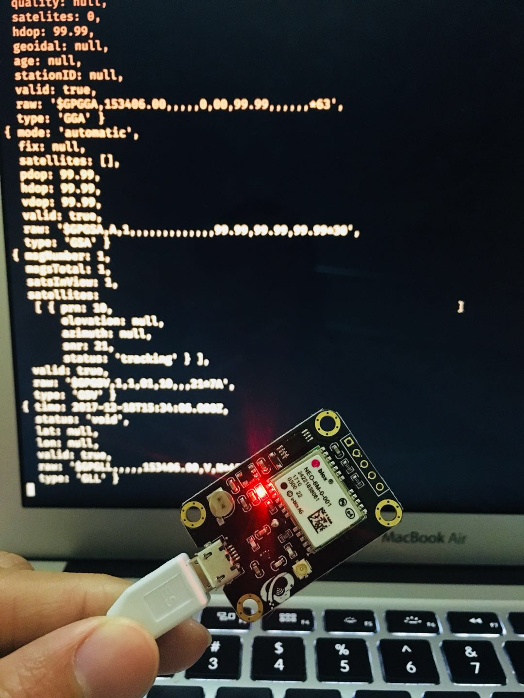

## gps2 

A GPS NMEA parser library

### Installation

```bash
$ npm i node-gps --save
```

### Example

```js
const GPS = require('node-gps');

const gps = new GPS();

gps.on('data', (location) => {
  console.log(location);
});

fs
.createReadStream('/dev/gps-module')
.pipe(gps)

```



### Contributing
- Fork this Repo first
- Clone your Repo
- Install dependencies by `$ npm install`
- Checkout a feature branch
- Feel free to add your features
- Make sure your features are fully tested
- Publish your local branch, Open a pull request
- Enjoy hacking <3

### License

This works base on [Robert Eisele](https://www.xarg.org)'s [GPS.js](https://github.com/infusion/GPS.js) and under the [MIT](./LICENSE) license.